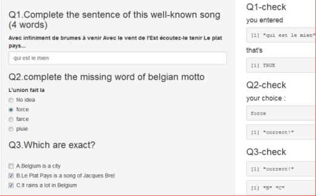
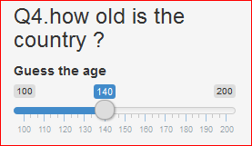
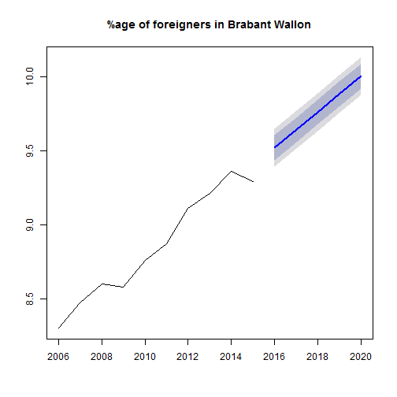

DataProducts Assignment - pitch - some tips about Belgium
========================================================
author: Michele Martin
font-family: 'Arial'
date: 3.07.2016

Application "what is Belgium ?""
========================================================

- The application contains a quiz of 5 questions about Belgium to learn a little bit about this strange country
- It is written in R using Shiny features 

Questions 1 - 3
========================================================
- Questions 1 to 3   are using respectively "textInput" "radiobuttons" and"CheckboxGroupInput" commands. 

<small>RadioButtons are used when there are only 1 possible answer, "CheckboxGroupInput" are convenient for multiple choice questions.</small>

Questions  4
========================================================
- Question 4 : guess the age of the country using a Slider. This used the "slideInput" command, that is quite a nice feature !

Questions  5
========================================================
- Question 5 : Belgium is a open country, try to predict the number of foreign people in the region "brabant wallon "(near Brussels) in 2020 and check your answer with a simple prediction tool that plot the predictions for the next  years.

